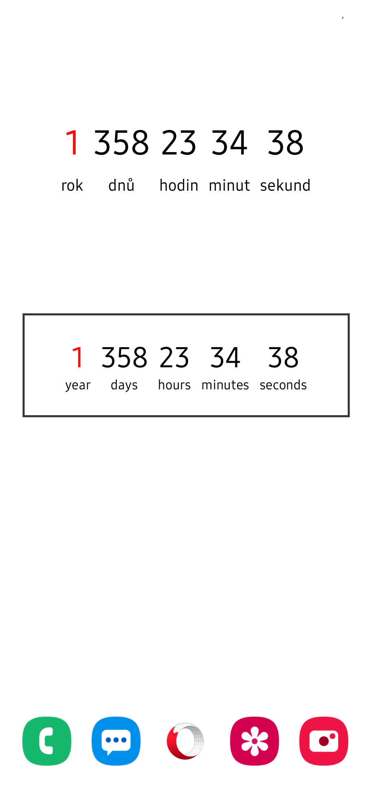
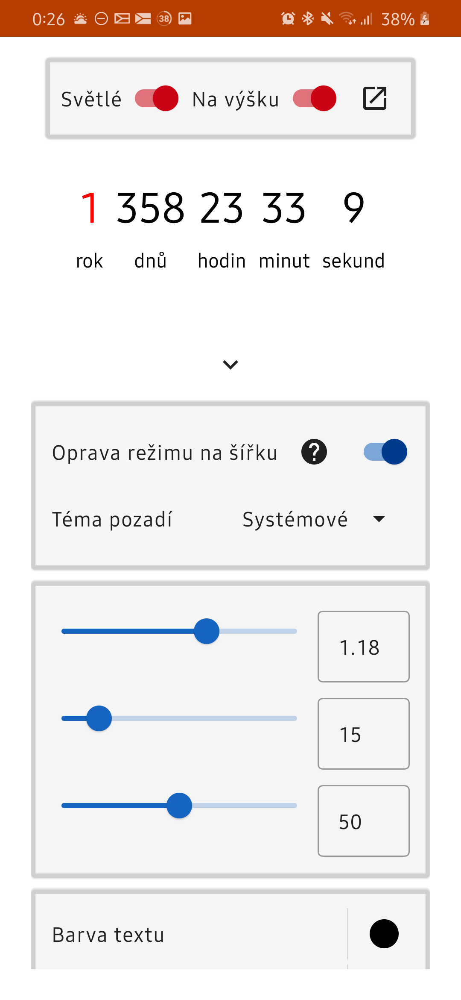
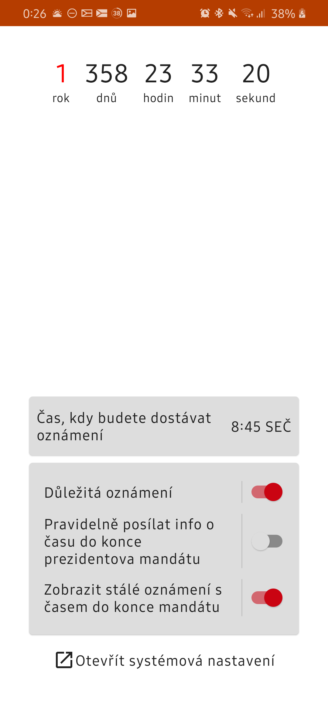
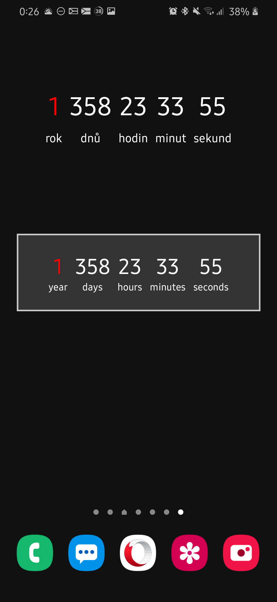
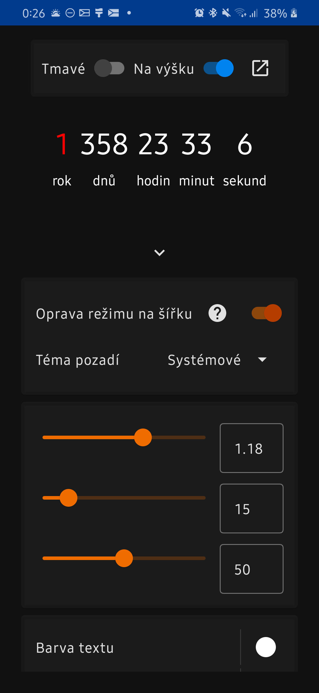
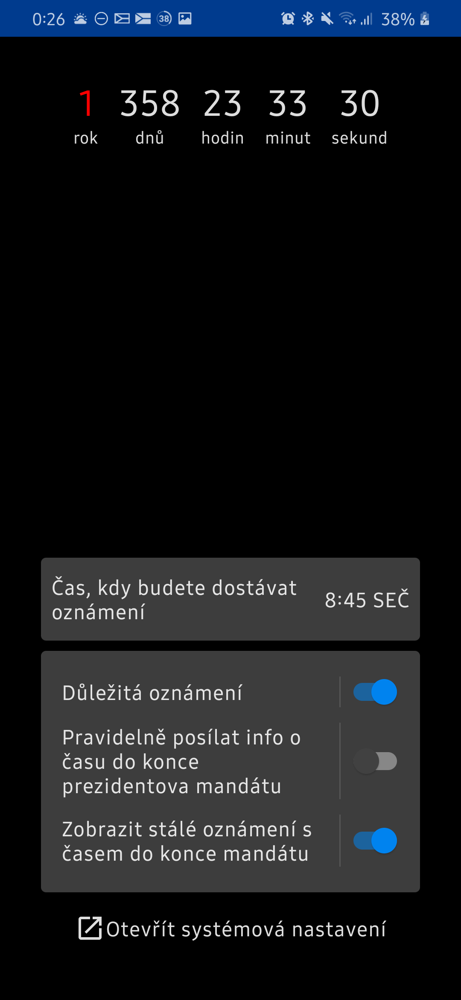

# Prezident do podhradí

To read this document in English, click [here](README.md).

Tato aplikace na Android zobrazuje zbývající čas do konce mandátu současného prezidenta České
republiky mnoha různými formami:

- Hodiny v aplikaci
- Živé pozadí
- Widget / nástroj plochy
- Notifikace / oznámení

Děkuji za inspiraci webu [www.zemancountdown.cz](https://www.zemancountdown.cz).

Aplikace je psaná v Kotlinu s pomocí Jetpack knihoven včetně Jetpack Compose UI toolkitu.

### Licence

Licencováno pod [GNU GPL v3.0](LICENSE.txt) licencí.

## Screenshoty

