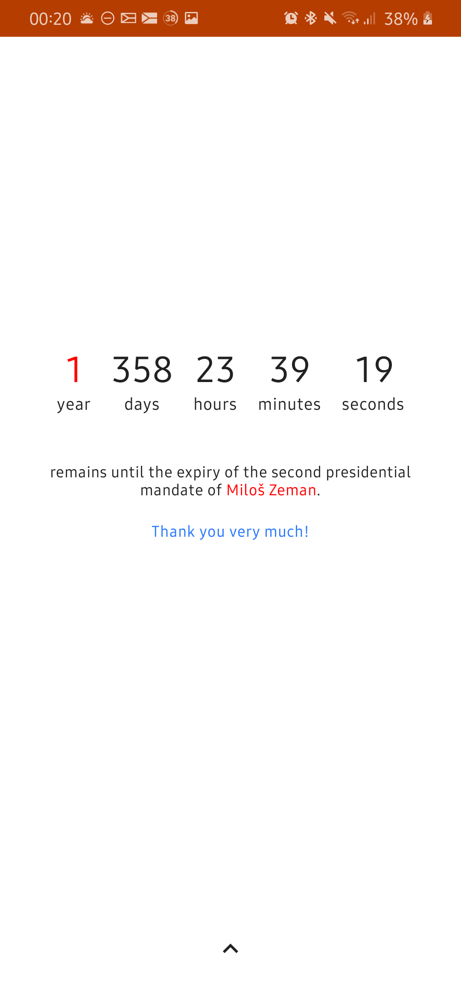
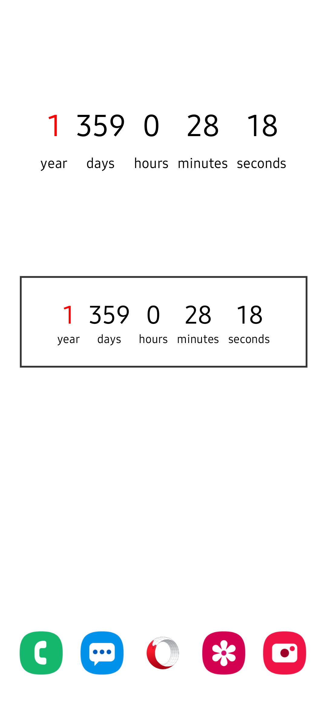
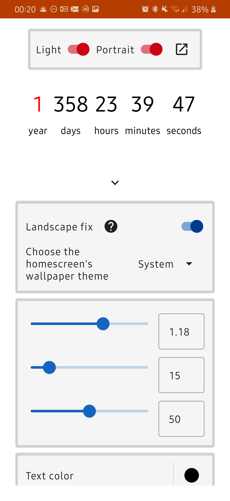
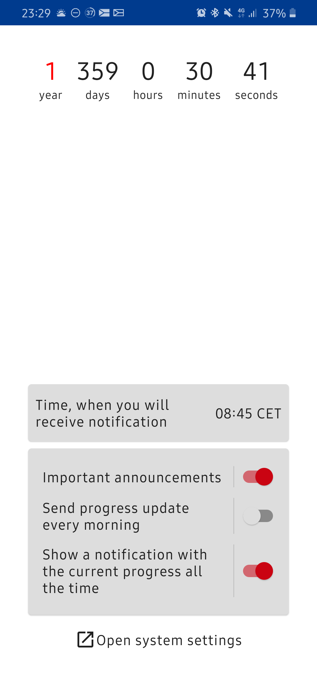
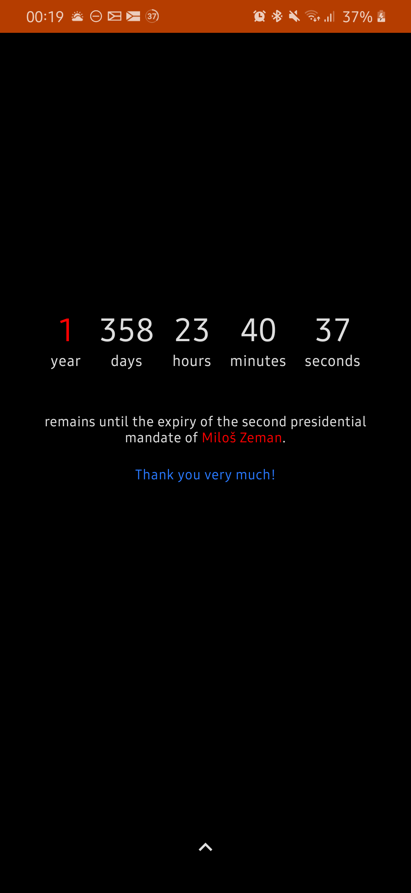
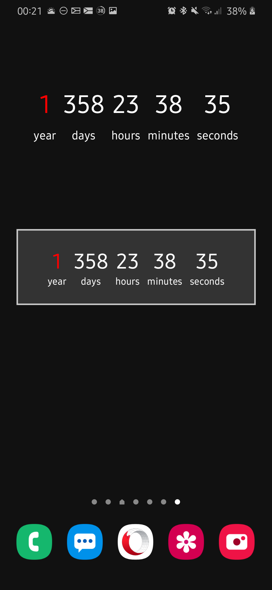
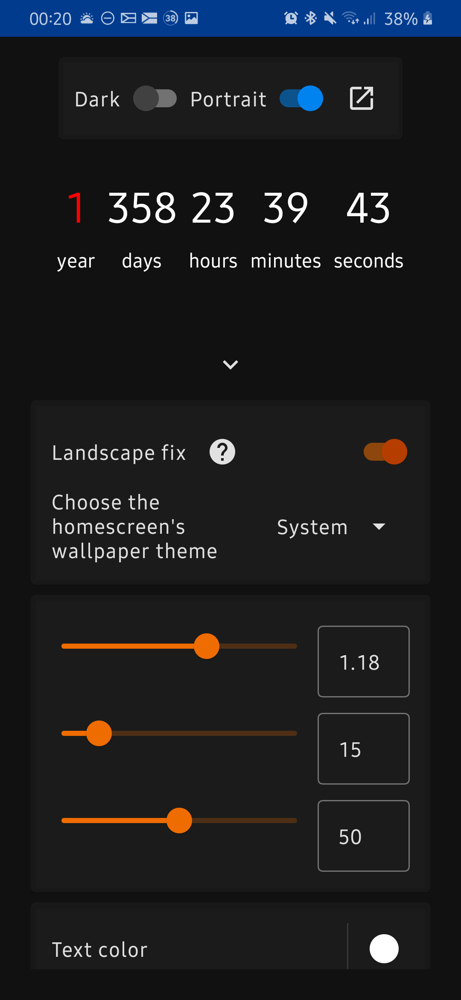
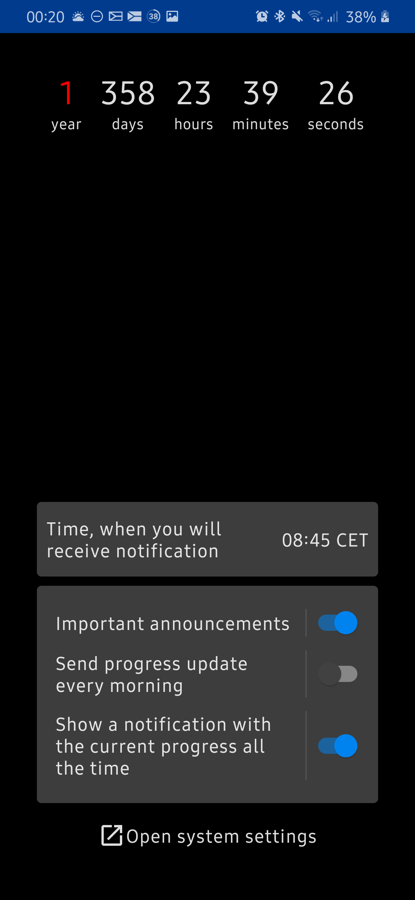

# President Countdown

Pokud si chcete tento soubor přečíst česky, klikněte [zde](README-CS.md).

This Android app shows the time left until the end of the mandate of the current Czech president. It can do it in many differend ways:

- Clock in the app
- Live wallpaper
- Widget
- Notifications

Many thanks to the developer of [www.zemancountdown.cz](https://www.zemancountdown.cz) for an
inspiration.

The app is written in Kotlin using Jetpack libraries including Jetpack Compose UI toolkit.

### License

Licensed under [GNU GPL v3.0](LICENSE.txt) license.

## Screenshots

